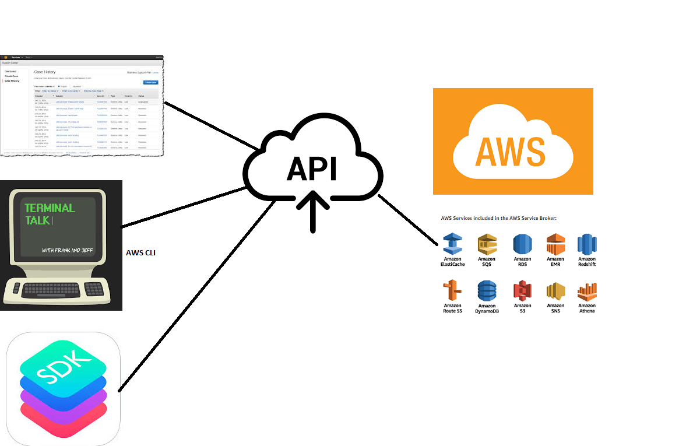

# CLI

## Why CLI for AWS?
* Because we want to automate
* For redundant activities we will write cli & execute
    * Linux
        * CRON Job
    * Windows
        * Scheduled Jobs
    * Jenkins

## How to use AWS CLI
* Intro:
  

* Setup:
    * Windows: [Click here](https://docs.aws.amazon.com/cli/latest/userguide/install-windows.html)
    * MAC [Click Here](https://docs.aws.amazon.com/cli/latest/userguide/install-macos.html)
    * Linux: [Click here](https://docs.aws.amazon.com/cli/latest/userguide/install-linux.html)

* Configuration:
    * Credentials:
        * AWS expects you to create a user
        * Give this user permissions
        * ACCESS Key & Secret Key info configure in CLI
        ```
        aws configure
        # Enter accesskey, secret access key, region code & json
        ```

* Syntax:
    * Generic Syntax
    ```
    aws <service> <action> <arguments/parameters>
    ```
    * Some examples:
        * Show me all s3 buckets
        ```
        aws s3 ls
        ```
        * create ec2 instance
        ```
        aws ec2 run-instance --instance-type t2.micro --image-id 
        ```

    * Hack approach:
        * google "aws <service> CLI"
            * aws rds cli
            * aws s3 cli
            * aws dynamodb cli
