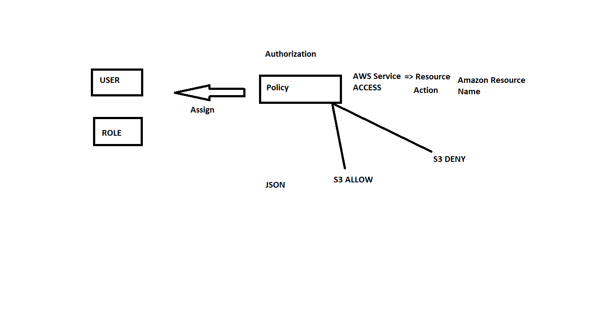

# User Management in AWS

## IAM (Identity and Access Mangement)
* Groups
* Users
* Roles
* Policies




## Excercise
1. Create a user with <any name> and give him administrator access (AWS Managed Policy)
2. Create another user with <any name> and give him EC2 Readonly policy
3. Play around with AWS Console by logging in as two users
4. Above mentioned access policies are around services not resources.

## Steps For effective Policy Writing
1. Get Familiar with [ARN](https://docs.aws.amazon.com/general/latest/gr/aws-arns-and-namespaces.html) 


## Building Policies
1. IAM Policy is a json 
```
{

}
```
2. Elements of polices [Refer Here](https://docs.aws.amazon.com/IAM/latest/UserGuide/reference_policies_elements.html)
    * Version:
        * [Reference](https://docs.aws.amazon.com/IAM/latest/UserGuide/reference_policies_elements_version.html)

    * Id:
        * [Reference](https://docs.aws.amazon.com/IAM/latest/UserGuide/reference_policies_elements_id.html)
    * Statement:
        * [Reference](https://docs.aws.amazon.com/IAM/latest/UserGuide/reference_policies_elements_statement.html)
        * [Sid](https://docs.aws.amazon.com/IAM/latest/UserGuide/reference_policies_elements_sid.html)
        * [Effect](https://docs.aws.amazon.com/IAM/latest/UserGuide/reference_policies_elements_effect.html)
        * [Principal](https://docs.aws.amazon.com/IAM/latest/UserGuide/reference_policies_elements_principal.html)
        * [Not Principal](https://docs.aws.amazon.com/IAM/latest/UserGuide/reference_policies_elements_notprincipal.html)
        * [Action](https://docs.aws.amazon.com/IAM/latest/UserGuide/reference_policies_elements_action.html)
        * [Resource](https://docs.aws.amazon.com/IAM/latest/UserGuide/reference_policies_elements_resource.html)
```
{
    "Version": "2012-10-17"
    "Statement": [
        {
             "Resource": "arn:aws:s3:::*",
            "Sid": "1",
            "Effect": "Allow",
            "Action": "s3:*"           
        }
    ]
}

```