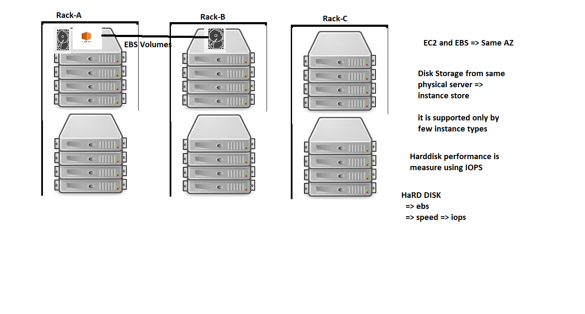

# Storage

## Mounting ebs on linux
* Refer [here](https://docs.aws.amazon.com/AWSEC2/latest/UserGuide/ebs-using-volumes.html#ebs-format-mount-volume)

* Mounts after reboot as well. Refer [here](https://docs.aws.amazon.com/AWSEC2/latest/UserGuide/ebs-using-volumes.html#ebs-mount-after-reboot)

* Elastic volume mount: After increasing size of disk Refer [here](https://docs.aws.amazon.com/AWSEC2/latest/UserGuide/recognize-expanded-volume-linux.html)