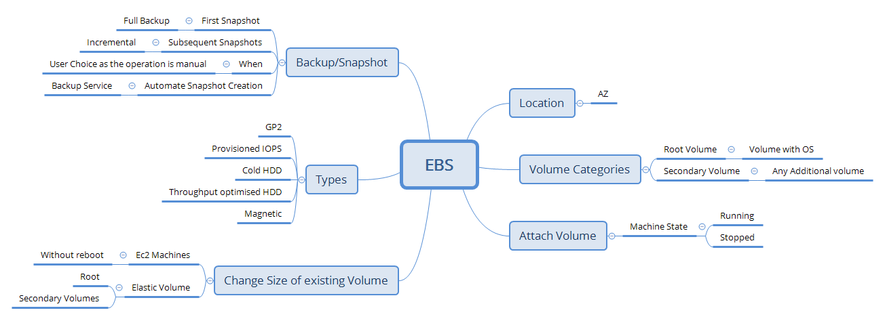

# Elastic Block Storage

## Understanding
* Experiment:
    * create a linux ec2 machine (t2.micro) in any region
        * Navigate to volumes section & look into description
            * Availability Zone:
                * Every volume (harddisk) scope is AZ
            * Snapshot:
                * Backup of Volume 
        * Add a volume to existing instance
            * [Refer](https://docs.aws.amazon.com/AWSEC2/latest/UserGuide/ebs-using-volumes.html)

    * create a windows ec2 machine (t2.micro) in any region

* Instance-Storage: 
    * Harddisk from the same physical server 
    * Can never be Root Volume
    * Instance Store is supported only by few instance types
