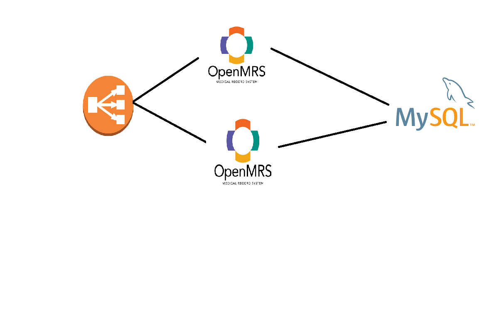

## Activity 1

*  Create an ami for any opensource application
    * Openmrs
        * Java web application which runs on tomcat7
        * It requires mysql
        * [Refer](https://wiki.openmrs.org/display/docs/Installing+OpenMRS)
        * Typical Steps:
            * Ubuntu 16/14
            * install required java version
            * Download a war file from openmrs website. Copy war file into tomcat's webapps folder
            * connect this to mysql
        * Architecture:
        
    * Shopizer
        * almost same steps
        * this is an ecommerce app