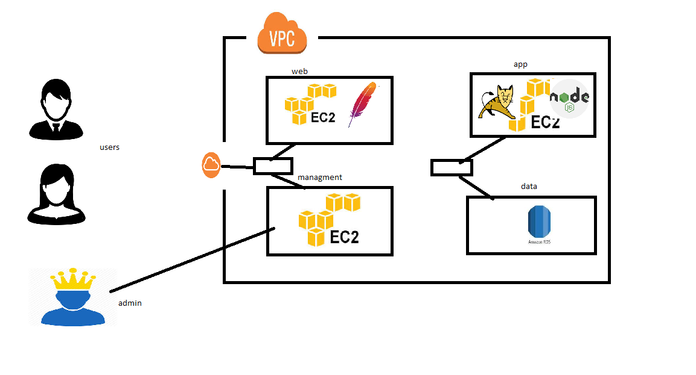

##  Exercise

* VPC
    * four subnets
        * web
        * app
        * data
        * management
    * internet gateway
    * two route tables
        * public rt
            * route to internet gw
        * private rt
    * subnet associations
        * web, management => public rt
        * app, data  => private rt
    * two ec2
        * web subnet => public ip
        * app subnet => dont want public ip

