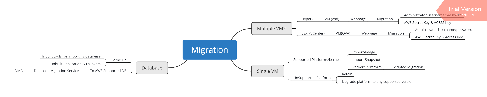

# AWS Migrations

## R's in focus

### Rehost
* Example Scenarios
    * VM with linux with some application 
        * will not be in aws
        * possible sources: 
            1. Azure
            2. VM (Hyper-V, Virtual Box , VMWare)
    * Database 
        * mysql
        * data : sample db
        * possible sources
            1. Azure
            2. VM (Hyper-V, Virtual Box, VmWare)
    * Multi VM Migration at one shot
        * Hyper-V
        * VmWare ESXI

### Activities

* Windows7, Windows 8, Windows 10 Home Edition:
    1. Install Virtual Box
    ```
    choco install virtualbox -y
    choco install vagrant -y
    ```
    2. Follow the steps
    ```
    # create some directory
    mkdir jenkins
    cd jenkins
    vagrant box add ubuntu/xenial64 # centos/7
    vagrant init ubuntu/xenial64
    ```
    3. Refer Vagrant file from [here](./VirtualBox/Vagrantfile)
    4. Create vm
    ```
    vagrant up
    ```


* Windows 10 (non home)
    1. Enable hyper-v
    2. Installations
    ```
    choco install vagrant -y
    ```
    3. Create the directory
    ```
    mkdir jenkins
    cd jenkins
    vagrant box add bento/ubuntu16.04
    vagrant init bento/ubuntu16.04
    ```
    4. Refer vagrant file from [here](./Hyperv/Vagrantfile)
    5. Execute the following commands
    ```
    vagrant up
    ```
	
	
	
### Migration Overview of AWS
